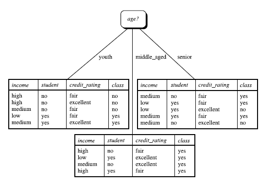

##Decision Tree

###机器学习中分类和预测算法的评估

- 准确率
- 速度
- 强壮性
- 可规模性
- 可解释性

###What is Decision Tree?

A decision tree is a decision support tool that uses a tree-like graph or model of decisions and their possible consequences, including chance event outcomes, resource costs, and utility. It is one way to display an algorithm.

<http://scikit-learn.org/stable/modules/tree.html>

> 上图框中的数字是天数。

判定树是一个类似于流程图的树结构: 其中, 每一个内部节点表示在一个属性上的测试, 每个分支代表一个属性输出, 而每个树叶节点代表类或者类分布。树的最顶层是根节点。它是**机器学习中分类方法的一个重要方法**。 

###决策树归纳算法(ID3)

怎么选择节点是个重要问题。

信息获取量(Information Gain): $Gain(A) = Info(D) - Infor_A(D)$, 通过 A 来作为节点分类。

直接用`class_label`(buys_computer)来分类的话, 那么信息量是 $Info(D) = H(5/14, 9/14) = 0.940 bit$
但若是以年龄来分类, $Info_{age}(D)=5/14*H(2/5, 3/5) + 4/14*H(1, 0) + 5/14*H(3/5, 2/5) = 0.694 bit$(第一个分式是在 5 年轻人中有 2 个买了,  3 个没买)
那么这两个相减得到$Gain(age) = Info(D) - Info_{age}(D) = 0.246 bit$
类似的,  $Gain(income) = 0.029 bit$, $Gain(student) = 0.151 bit$, $Gain(credit_rating) = 0.048 bit$
由于`Gain(age)`的值最大, 所以选择`age`作为根节点。

算法总结如下:

> 1. 树以代表训练样本的单个节点开始
> 2. 如果样本都在同一个类, 则该节点成为叶结点, 并用该类标号
> 3. 否则, 算法使用称为信息增益的基于熵的度量作为启发信息, 选择能够最好地将样本分类的属性。该属性成为该节点的"测试"或"判定"属性, 在算法的该版本中, 所有属性都是已分类的, 即离散值。连续属性必须离散化
> 4. 对测试属性的每个已知的值, 创建一个分支, 并依次划分样本
> 5. 算法使用同样的过程, 递归的形成每个划分上的样本判定树。一旦一个属性出现在一个节点上, 就不必该节点的任何后代考虑它
> 6. 递归划分步骤仅当下列条件之一成立停止:
>       a) 给定节点的所有样本属于同一类。
>       b) 没有剩余属性可以用来进一步划分样本。在此情况下, 使用多数表决(哪个类占大多数就归于哪一类)。这涉及到将给定的节点转换成树叶, 并用样本中的多数所在的类标记它。替换的, 可以存放节点样本的类分布。
>       c) 分支,  $test_attribute = a_i$, 即没有样本, 这种情况下, 以samples中的多数类创建一个树叶。

其他算法:

- C4.5: Quinlan
- Classification and Regression Trees(CART): (L.Breiman, J.Fridman, R.Olshen, C.Stone)

**共同点**: 都是贪心算法,  自上而下
**区别**: 属性选择度量方法不同, C4.5(gain ratio), CART(gini index), ID3(Information Gain)

Q: 如何处理连续变量的属性?

Q: 如何解决overfitting?
A: 原因是分的太细, 在训练集上跑的很好, 但是在测试集上表现很差。解决方法是 a) 先剪枝(分到一定程度就不分了); b) 后剪枝(完完全全建好树, 根据一个标准, 将下面的叶子剪掉)。

Q: 决策树优点缺点?
A: 优: 直观, 便于理解, 小规模数据有效
缺: 处理连续变量不好(阈值对结果影响很大)
类比较多的时候, 错误增加的比较快
可规模性一般

Important:
> Notes: 在将feature转化为值的时候, 使用的是scilearn的库, 假如在age中有三个值, 如middle_age, youth, senior那么这个库会将它指示为3个值, 比如1, 0, 0作为中年; 假如age有两个值, 那么就会只使用1, 0 来指示。生成的列表如下所示

dummyX: 
[[ 0.  0.  1.  0.  1.  1.  0.  0.  1.  0.]
[ 0.  0.  1.  1.  0.  1.  0.  0.  1.  0.]
[ 1.  0.  0.  0.  1.  1.  0.  0.  1.  0.]
[ 0.  1.  0.  0.  1.  0.  0.  1.  1.  0.]
[ 0.  1.  0.  0.  1.  0.  1.  0.  0.  1.]
[ 0.  1.  0.  1.  0.  0.  1.  0.  0.  1.]
[ 1.  0.  0.  1.  0.  0.  1.  0.  0.  1.]
[ 0.  0.  1.  0.  1.  0.  0.  1.  1.  0.]
[ 0.  0.  1.  0.  1.  0.  1.  0.  0.  1.]
[ 0.  1.  0.  0.  1.  0.  0.  1.  0.  1.]
[ 0.  0.  1.  1.  0.  0.  0.  1.  0.  1.]
[ 1.  0.  0.  1.  0.  0.  0.  1.  1.  0.]
[ 1.  0.  0.  0.  1.  1.  0.  0.  0.  1.]
[ 0.  1.  0.  1.  0.  0.  0.  1.  1.  0.]]

其中不含有关于多少feature的信息。这个信息在`vec.get_feature_names()`方法中可以得到。得到的结果是这样的
['age=middle_aged', 'age=senior', 'age=youth', 'credit_rating=excellent', 'credit_rating=fair', 'income=high', 'income=low', 'income=medium', 'student=no', 'student=yes']

