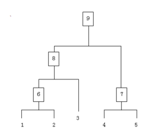

##聚类(Clustering): hierarchical clustering 层次聚类

假设有 N 个待聚类的样本, 对于层次聚类来说, 步骤:

1. (初始化)把每个样本归为一类, 计算每两个类之间的距离, 也就是样本与样本之间的相似度
2. 寻找各个类之间最近的两个类, 把他们归为一类(这样类的总数就少了一个)
3. 重新计算新生成的这个类与各个旧类之间的相似度
4. 重复 2 和 3 直到所有样本点都归为一类, 结束

整个聚类过程其实是建立了一棵树, 在建立的过程中, 可以通过在第二步上设置一个阈值, 当最近的两个类的距离大于这个阈值, 则认为迭代可以终止。**另外关键的一步就是第三步, 如何判断两个类之间的相似度有不少种方法。**这里介绍一下三种:

- SingLinkage: 又叫做 nearest-neighbor, 就是取两个类中距离最近的两个样本的距离作为这两个集合的距离, 也就是说, 最近两个样本之间的距离越小, 这两个类之间的相似度也就越大。容易造成一种 chaining 的效果, 两个 cluster 明明从大局上离得比较远, 但是由于其中个别的点距离比较近就被合并了, 并且这样合并之后 chaining 效应会进一步扩大, 最后会得到比较松散的 cluster。(比如{1, 2}和{4, 5}之间的距离, 计算min{(1,4), (1,5), (2,4), (2,5)})

- CompleteLinkage: 这个则是 SingLinkage 的反面极端, 取两个集合中距离最远的两个点的距离作为两个集合的距离。其效果也是刚好相反的, 限制非常大, 两个 cluster 即使很接近了, 但是只要有不配合的点存在, 就绝不合并, 也是不太好的办法。这两种相似度的定义方法的共同问题就是指考虑了某个有特点的数据, 而没有考虑类内数据的整体特点。

- AverageLinkage: 这种方法就是把两个集合中的点两两的距离全部放在一起求一个平均值, 相对也能得到合适一点的结果。AverageLinkage 的一个变种就是两两距离的中值, 与取均值相比更加能够解除个别偏离样本对结果的干扰。

> python实现有些复杂, 先进入 CNN 课程。
