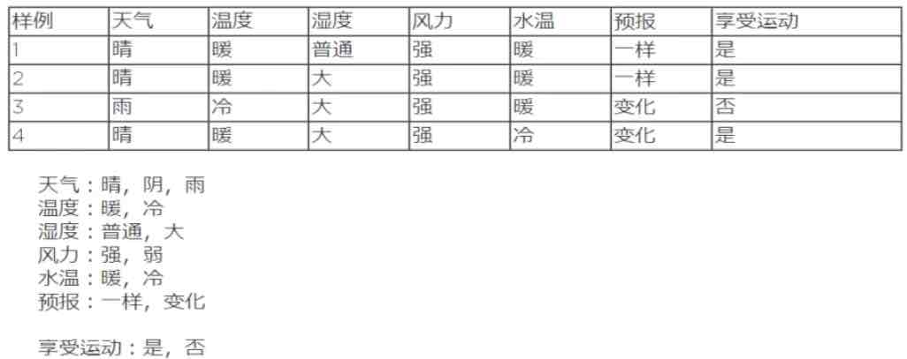
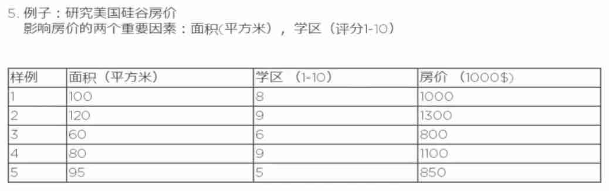
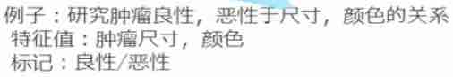

##Machine Learning

###Framework

####Supervised Learning: Classification

- Decision Tree(1 theory and 1 application)
    - 银行信用自动评估系统
- Nearest Neighbor(1 theory and 1 application)
    - 人脸识别
- Support Vector Machine(SVM)(2 theory and 2 application)
    - 图片中的红眼识别
    - 结肠癌的早晚期分类
- Neural Network(2 theory and 2 application)
    - 手写数字识别
    - 图片分类

####Superivised Learning: Regression

- Linear Regression(2 theory and 2 application)
    - 销量预测
    - 价格预测
- Non-linear Regression(2 theory and 2 applicaiton)
    - 销量预测
    - 价格预测

####Unsupervised Learning

- K-mean(Clustering 1 theory and 1 application)
    - 人脸分类
- Hierarchial clustering(1 theory and 1 application)
    - 人脸噪音排除

###Introduction

####Machine Learning

**Machine learning** is a type of artificial intelligence (AI) that provides computers with the ability to learn **without being explicitly programmed**. Machine learning focuses on the development of computer programs that can change when exposed to new data. The process of machine learning is similar to that of data mining.

Both systems search through data to look for **patterns**. However, instead of extracting data for human comprehension -- as is the case in data mining applications -- **machine learning uses that data to detect patterns in data and adjust program actions accordingly**. Machine learning algorithms are often categorized as being supervised or unsupervized. Supervised algorithms can apply what has been learned in the past to new data. **Unsupervised algorithms can draw inferences from datasets.**

> ML 是交叉学科, 涉及概率论, 统计学, 逼近论, 凸分析, 算法复杂度等多门学科。**它是 AI 的核心, 是计算机具有智能的根本途径。ML 主要使用归纳, 综合而不是演绎。**
> 定义: 探索和开发一系列算法来如何使用计算机不需要外部明显指示, 而可以自己通过数据来学习, 建模, 并且利用建好的模型和新的输入来进行预测的学科。
>
> 学习: 针对经验 E(experience) 和一系列的任务 T(tasks) 和一定表现的衡量 P(performance), 如果随之经验 E 的积累, 针对定义好的任务 T 可以提高表现 P, 就说机器具有学习能力。 

####Deep learning

**Deep learning** (also known as deep structured learning, hierarchical learning or deep machine learning) is a branch of machine learning based on a set of algorithms that attempt to model high level abstractions in data. In a simple case, you could have two sets of neurons: **ones that receive an input signal and ones that send an output signal.** When the input layer receives an input it passes on a modified version of the input to the next layer. In a deep network, there are many layers between the input and output (and the layers are not made of neurons but it can help to think of it that way), allowing the algorithm to use multiple processing layers, composed of multiple linear and non-linear transformations.

> 深度学习是基于机器学习延伸出来的一个新的领域, 由以人大脑结构为启发的神经网络算法为起源加之模型结构深度的增加发展, 并伴随大数据和计算能力的提高而产生的一系列的算法。
> 神经网络计算复杂度很高, 一旦层数变高, 那么计算的复杂度就会变得很高。但是近二十年的计算能力的提高和数据的提升, 所以神经网络有了大的突破。并且精度比传统算法高很多。

NIVIDA DRIVE PX DEEP NEURAL NETWORK COMPUTER VISION
<https://www.youtube.com/watch?v=zsVsUvx8ieo>

###机器学习的基础概念

概念学习 := **概念学习是指从有关某个布尔函数的输入输出训练中样例中推断出该布尔函数。**

> 例如: 学习"享受运动"这一概念:
> 小明进行水上运动, 是否享受运动取决于很多因素。
 

**概念定义在实例(instance, 如上图的每一行)集合之上, 这个集合表示为 X(X: 所有可能的日子, 每个日子的指由天气等6个属性表示)。待学习的概念或者目标函数成为目标概念(target concept), 记作 c。** `c(x)=1`是享受运动的时候, `c(x)=0`是不享受运动的时候, `c(x)`也可以记作 y。

> x: 每一个实例
> X: 样例,  所有实例的集合
> 学习目标: f: X -> Y

- 训练集(training set/data)/训练样例(training examples): 用来进行训练, 即产生模型或者算法的数据集 
- 测试集(testing set/data)/测试样例(testing examples): 用来专门进行测试已经学习好的模型或者算法的数据集
- 特征值(features/feature vector): 属性的集合, 通常用一个向量来表示, 附属于一个实例(比如每一行的 6 个因素的值可以用一个向量表示, 即为特征向量)
- 标记(label): c(x), 实例类别的标记(比如对于第一个实例, 享受运动是`是`)
- positive example and negative example

- 分类(classification): 目标标记为类别型数据(category)(比如上面的是否享受游泳)
- 回归(regression): 目标标记为连续性数值(continuous numeric value)(房价的这个是连续的)

> 这两类的算法是不同的。

> 我们只知道肿瘤的尺寸和颜色, 但是不知道它是良性还是恶性的。

- 有监督学习(supervised learning): 训练集有类别标记(class label)
- 非监督学习(unspervised learning): 无类别标记(class label)
- 半监督学习(semi-supervised learning): 一部分数据有类别标记的训练集 + 另一部分无标记的训练集

####机器学习步骤框架

1. 把数据拆分为**训练集**和**测试集**
2. 把训练集和测试集的**特征向量**来训练算法
3. 用学习来的算法**运用在测试集上来评估算法**(可能要设计调整参数(parameter tuning) 用验证集(validation set))

