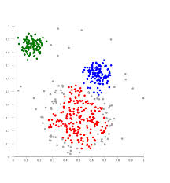

##聚类(Clustering): K-means 算法

聚类(clustering)属于非监督学习(unsupervised learning)。无类别标记。

###K-means 算法

Clustering 中的经典算法, 数据挖掘十大经典算法之一。

算法接受参数K(分为几类), 然后将事先输入的 n 个数据对象划分为 K 的聚类以便使得所获得的聚类满足: **同一聚类中的对象相似度较高; 而不同聚类中的对象相似度较小**。

算法思想:
以空间中 K 个点为中心进行聚类, 对最靠近他们的对象归类。通过迭代的方法, 逐次更新各聚类中心的值, 直至得到最好的结果。

算法描述:

1)适当选择 c 个类的初始中心;

2)在第 k 次迭代中, 对任意一个样本, 求其到 c 各中心的距离, 将该样本归到距离最短的中心所在的类;

3)利用均值等方法更新该类的中心值(比如将上图所有绿点的均值求出, 选择接近中心的那个点);

4)对于所有的 c 个聚类中心, 如果利用2), 3)的迭代法更新后, 值保持不变, 则迭代结束, 否则继续迭代。

算法流程:

输入: k, data[n]

1) 选择 k 个初始中心点, 例如c[0] = data[0], ..., c[k-1] = data[k-1]

2)对于data[0], ..., data[n], 分别与c[0], ..., c[k-1]比较, 假如与c[i]差值最少, 就标记为 i

3)对于所有标记为 i 的点, 重新计算c[i] = {所有标记为 i 的 data[j] 之和}/标记为 i 的个数

4) 重复2), 3), 直到所有 c[i] 值的变化小于给定阈值

优点: 速度快, 简单。
缺点: **最终结果跟初始点选择有关**, 容易陷入局部最优, 需知道 K 值。

