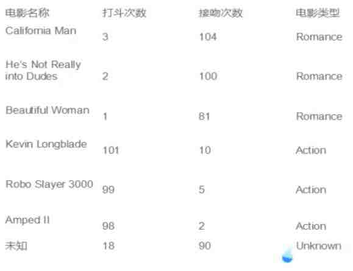
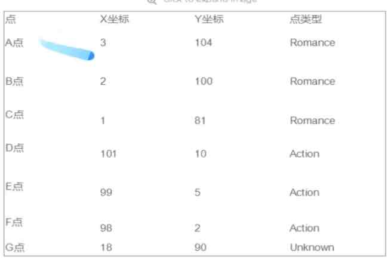
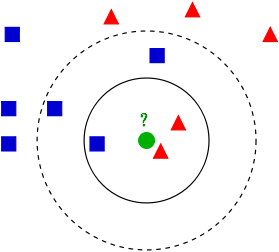
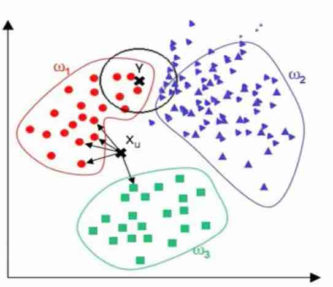

##KNN(K-Nearest-Neighbor) Algorithm

In pattern recognition, the k-Nearest Neighbors algorithm (or k-NN for short) is a non-parametric method used for classification and regression. In both cases, the input consists of the k closest training examples in the feature space. The output depends on whether k-NN is used for classification or regression:

- In k-NN classification, the output is a class membership. An object is classified by a majority vote of its neighbors, with the object being assigned to the class most common among its k nearest neighbors (k is a positive integer, typically small). If k = 1, then the object is simply assigned to the class of that single nearest neighbor.
- In k-NN regression, the output is the property value for the object. This value is the average of the values of its k nearest neighbors.

> KNN在1968年被Cover和Hart发明的最初临近算法
> 是一类分类(classification)算法
> 输入基于实例的学习(instance-based learning)/懒惰学习(lazy learning)。在开始不建立任何的模型, 每一次学习是根据实例来进行的。处理测试集的时候并没有建立任何的模型, 当开始归类的时候, 才和已知的训练集的数据进行比较。

抽象为空间中的点。

算法详述:

1. 为了判断未知实例的类别, 以所有已知类别的实例作为参考
2. 选择参数K(选择K个与待分类样本的邻居)
3. 计算未知实例与所有已知实例的距离
4. 选择最近K个已知实例
5. 根据少数服从多数的投票法则(majority-voting), 让未知实例归类为K个最领近样本中最多数的类别

> 细节: 
> - 关于K
> - 关于距离的衡量方法: Euclidean Distance定义
> - 其他关于距离的衡量方法: 余弦值(cos), 相关度(correlation), 曼哈顿距离(manhattan distance)

KNN算法对K的取值非常敏感。K=1的时候不能防止噪音。通常增大K来抑制噪音。且K一般取奇数, 以便出现不能voting。

###算法优缺点

优点:
- 简单
- 易于理解
- 容易实现
- 通过对K的选择可具备丢噪音数据的健壮性

缺点:

- 需要大量空间存储所有已知的实例
- 算法复杂度很高(需要比较所以已知实例与要分类的实例)
- 当样本分布不平衡的时候, 比如其中一类样本太多占主导的时候, 新的未知实例容易被归类为这个主导样本, 因为这类样本实例的数量过大, 但这个新的未知实例并未接近目标样本

改进:
考虑距离, 根据距离加上权重
比如: 1/d   (d: 距离)

