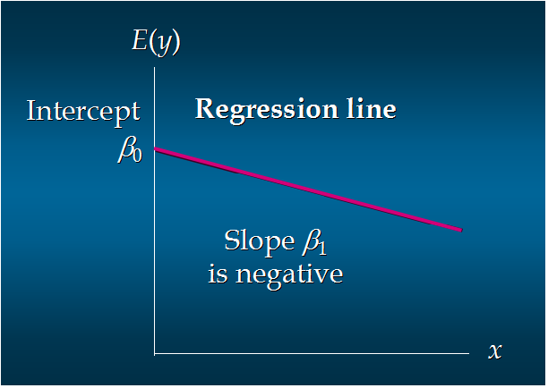

##Simple Linear Regression

为什么需要统计量? ---> 描述数据特征。


####集中趋势衡量

1. 均值
2. 中位数(median): 将数据中的各个数值按照大小循序排列, 居于中间位置的变量。当 n 为奇数的时候, 直接取位置处于中间的数; 当 n 为偶数的时候, 取中间两个量的平均值。
3. 众数(mode): 数据中出现次数最多的数


####离散程度的衡量

1. 方差(variance)


2. 标准差(standard deviation)


###Introduction

介绍(注意是对 Y): 
- 回归(regression) Y 变量为连续数值型(continous numberical variable)。如: 房价, 人数, 降雨量
- 分类(classificaiton): Y 变量为类别型(categorical variable)。如: 颜色类别, 电脑品牌, 有无信誉


简单线性回归(Simple Linear Regression)
- 很多做决定过程通常是根据两个或者多个变量之间的关系
- 回归分析(regression analysis)用来建立方程模拟两个或者多个变量之间如何关联
- 被预测的变量叫做: 因变量(dependent variable), 即为输出 y (output)
- 被用来进行预测的变量叫做: 自变量(indenpent variable), 即为输入 x (input)


简单线性回归介绍
- 简单线性回归包含一个自变量(x)和一个因变量(y)
- 以上两个变量的关系用一个直线来模拟
- 如果包含两个以上的自变量, 则称为多元回归分析(multiple regression)


简单线性回归模型
- 被用来描述因变量(y)和自变量(X)以及偏差(error)之间关系的方程叫做归回模型
- 简单线性回归的模型是:


简单线性回归方程:  $E(y) = β_0+β_1x$
**这个方程对应的图像是一条直线, 称作回归线。**
其中, β0是回归线的截距, β1是回归线的斜率, E(y)是在一个给定 x 值下 y 的期望值(均值)。

> 对模型的期望值求期望和对回归方程求期望, 对偏差的期望为0。(偏差的分布为正态分布)


正向线性关系:


负向线性关系:




无关系:


估计的简单线性回归方程: $ŷ=b_0+b_1x$

这个方程叫做估计线性方程(estimated regression line), 其中, b0是估计线性方程的纵截距;  b1是估计线性方程的斜率;  ŷ是在自变量x等于一个给定值的时候，y的估计值


###线性回归分析流程


$\beta 0$和$\beta 1$是真实的值, b0 和 b1 是对这两个值的估计。

关于偏差ε的假定
- 是一个随机的变量, 均值为0
- ε 的方差(variance)对于所有的自变量 x 是一样的
- ε 的值是独立的
- ε 满足正态分布


####简单线性回归实例

```
Number of TV ads(x)     Number of Cars sold(y)
1                       14
3                       24
2                       18
1                       17
3                       27
sum x = 10              sum y = 100
ave x = 2               ave y = 20
```


目标就是使得`sum of squares`最小。


<hr>


###多元回归分析

多元回归模型: $y=β_0+β_1x_1+β_2x_2+ ... +β_px_p+ε$
其中: $β_0, β_1, β_2, ... β_p$是参数; ε是误差值

多元回归方程: $E(y)=β_0+β_1x_1+β_2x_2+ ... +β_px_p$

估计多元回归方程: $ŷ=b_0+b_1x_1+b_2x_2+ ... +b_px_p$
一个样本被用来计算β0, β1, β2... βp的点估计b0, b1, b2, ..., bp

> 从样本中估计只能得到参数的估计值。


估计流程和简单线性回归类似。


估计方法仍然是使得`sum of squares`最小。运算与简单线性回归类似, 涉及到线性代数和矩阵代数的运算。


```csv
Driving assignment, X1=miles Traveled, X2=number of deliveries, Y=travel time(hours)
1,100,4,9.3
2,50,3,4.8
3,100,4,8.9
4,100,2,6.5
5,50,2,4.2
6,80,2,6.2
7,75,3,7.4
8,65,4,6.0
9,90,3,7.6
10,90,2,6.1

Time = b0+ b1*Miles + b2 * Deliveries 
---> 除了我们挑选出来的miles和deliveries这两个影响因素之外, 其他的影响因素都在误差的那个随机变量中体现。
```

假设得到: Time = -0.869 + 0.0611 Miles + 0.923 Deliveries 

描述参数含义:
- b0: 平均多运送一英里, 运输时间延长 0.0611 小时
- b1: 平均多一次运输, 运输时间延长 0.923 小时

预测: 如果一个运输任务是跑 102 英里，运输 6 次，预计多少小时？
Time = -0.869 + 0.0611 * 102 + 0.923 * 6 = 10.9 (小时)


Q: 如果自变量中有分类型变量(categorical data), 如何处理? (在输入也是可以是类别型变量, 并不代表大小)

```
英里数  次数    车型    时间
100     4        1      9.3
50      3        0      4.8
100		4        1      8.9
100		2        2      6.5
50 		2        2      4.2
80 		2        1      6.2
75 		3        1      7.4
65 		4        0      6
90 		3        0      7.6
```

关于误差的分布
- 误差 ε 是一个随机变量, 均值为0
- ε 的方差对于所有的自变量来说相等
- 所有ε的值是独立的
- ε 满足正态分布，并且通过$β_0+β_1x_1+β_2x_2+ ... +β_px_p$反映 y 的期望值


