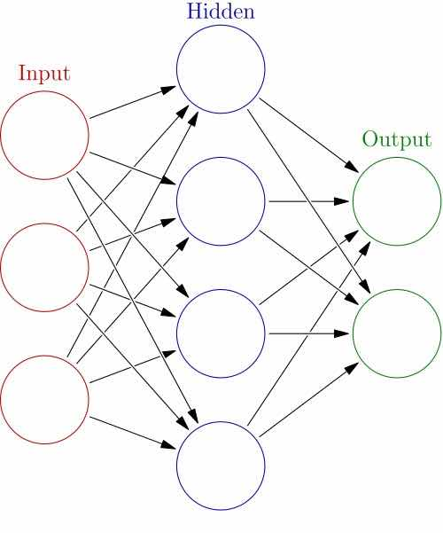

##Neural Networks in Python

<https://rolisz.ro/2013/04/18/neural-networks-in-python/>

2013/4/18


Artificial Neural Networks are a mathematical model, inspired by the brain, that is often used in machine learning. It was initially proposed in the '40s and there was some interest initially, but it waned soon due to the inefficient training algorithms used and the lack of computing power. More recently however they have started to be used again, especially since the introduction of autoencoders, convolutional nets, dropout regularization and other techniques that improve their performance significantly.


Here I will present a simple multilayer perceptron, implemented in Python using numpy.


**Neural networks are formed by neurons that are connected to each others and that send each other signals. If the number of signals a neuron received is over a threshold, it then sends a signal to neurons it is connected. In the general case, the connections can be between any neurons, even to themselves, but it gets pretty hard to train them, so in most cases there are several restrictions to them.**


In the case of the multilayer perceptron, neurons are arranged into layers, and each neuron sends signals only to the next neurons in the following layer. The first layer consists of the input data, while the last layer is called the output layer and contains the predicted values.




Instead of using a hard threshold to decide whether to send a signal or not (this has the disadvantage of not being a differentiable function), multilayer perceptrons use sigmoid functions such as the hyperbolic tangent or the logistic function ($ f(x) = \frac{1}{1+e^{x}} $).


**The most common algorithm used to train MLPs is the backpropagation algorithm. It has two phases:**
1. A forward pass, in which the training data is run through the network to obtain it's output
2. A backward pass, in which, starting from the output, the errors for each neuron are calculated and then used to adjust the weight of the network

That's the rough summary of the algorithm, so let's start implementing it.

<hr>

First, we define our activation functions and their derivatives, using numpy.

```python
import numpy as np

def tanh(x):
    return np.tanh(x)

def tanh_deriv(x):
    return 1.0 - np.tanh(x)**2

def logistic(x):
    return 1/(1 + np.exp(-x))

def logistic_derivative(x):
    return logistic(x)*(1-logistic(x))
```

In the constructor of the class we will need to set the number of neurons in each layer, initialize their weights randomly between -0.25 and 0.25 and set the activation function to be used. Each layer, except the last one, will also have a bias unit which corresponds to the threshold value for the activation.


```python
class NeuralNetwork:
    def __init__(self, layers, activation='tanh'):
        """
        :param layers: A list containing the number of units in each layer.
        Should be at least two values
        :param activation: The activation function to be used. Can be
        "logistic" or "tanh"
        """
        if activation == 'logistic':
            self.activation = logistic
            self.activation_deriv = logistic_derivative
        elif activation == 'tanh':
            self.activation = tanh
            self.activation_deriv = tanh_deriv

        self.weights = []
        for i in range(1, len(layers) - 1):
            self.weights.append((2*np.random.random((layers[i - 1] + 1, layers[i] + 1))-1)*0.25)
        self.weights.append((2*np.random.random((layers[i] + 1, layers[i + 1]))-1)*0.25)
```


Now we get to the fun part: the training. Given a set of input vectors X and output values y, adjust the weights appropiately. The algorithm we will use is called **stochastic gradient descent, which chooses randomly a sample from the training data and does the backpropagation for that sample, and this is repeated for a number of times (called epochs)**. We also have to set the **learning rate** of the algorithm, which determines how big a change occurs in the weights each time (proportionally to the errors).


```python
def fit(self, X, y, learning_rate=0.2, epochs=10000):
        X = np.atleast_2d(X)
        temp = np.ones([X.shape[0], X.shape[1]+1])
        temp[:, 0:-1] = X  # adding the bias unit to the input layer
        X = temp
        y = np.array(y)

        for k in range(epochs):
            i = np.random.randint(X.shape[0])
            a = [X[i]]

            for l in range(len(self.weights)):
                a.append(self.activation(np.dot(a[l], self.weights[l])))
            error = y[i] - a[-1]
            deltas = [error * self.activation_deriv(a[-1])]

            for l in range(len(a) - 2, 0, -1): # we need to begin at the second to last layer
                deltas.append(deltas[-1].dot(self.weights[l].T)*self.activation_deriv(a[l]))
            deltas.reverse()
            for i in range(len(self.weights)):
                layer = np.atleast_2d(a[i])
                delta = np.atleast_2d(deltas[i])
                self.weights[i] += learning_rate * layer.T.dot(delta)
```


And now the useful part: **prediction**. This is pretty much the same as the forward pass part of backpropagation, **except we don't need to keep all the values of the activations for each neuron, so we keep only the last one**.


```python
def predict(self, x):
    x = np.array(x)
    temp = np.ones(x.shape[0]+1)
    temp[0:-1] = x
    a = temp
    for l in range(0, len(self.weights)):
        a = self.activation(np.dot(a, self.weights[l]))
    return a
```


And that's it. 50 lines of code for the neural network itself, plus 10 more for the activation functions. 


Let's start with something simple: the XOR function. **The XOR function is not linearly separable (if we represent it in plane, there is no line that can separate the points with label 1 from the points with label 0)**, and this means we need at least one hidden layer. We will use it with 2 units.


```python
nn = NeuralNetwork([2,2,1], 'tanh')
X = np.array([[0, 0], [0, 1], [1, 0], [1, 1]])
y = np.array([0, 1, 1, 0])
nn.fit(X, y)
for i in [[0, 0], [0, 1], [1, 0], [1,1]]:
    print(i,nn.predict(i))
```

And the output is:

```python
([0, 0], array([  4.01282568e-05]))
([0, 1], array([ 0.98765949]))
([1, 0], array([ 0.98771753]))
([1, 1], array([ 0.00490502]))
```

Pretty good. If we instead used a step function for the activations in the output layer, we would get the exact results.


Now let's take a look at something slightly more complicated: the digits dataset that comes included with scikit-learn. This has 1797 8x8 pixel images of digits with their labels. Lets see what accuracies can we get on them. We will have to transform the labels from values (such as 1 or 5), to vectors of 10 elements, which are all 0 except for the position corresponding to the label, which will be one.


