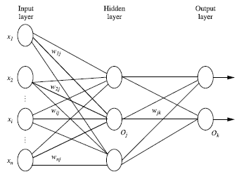
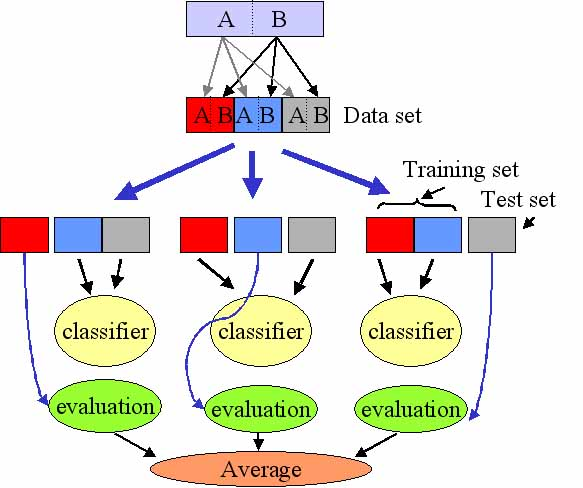
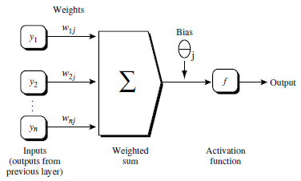
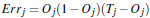
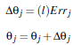

##Neural Network

神经网络算法非常重要。

背景: 以人脑中的神经网络为启发, 历史上出现多种版本
最著名的算法是1980年的backpropagation

###多层向前神经网络(Multilayer Feed-forward Neural Network)

Backpropagation 被使用在多层向前神经网络上。
多层向前神经网络由以下部分组成:
- 输入层(input layers)
- 隐藏层(hidden layers)
- 输出层(output layers)

每一层由单元(units)组成, 输入层(inputs layers)是由训练集的实例特征向量传入, 经过连接节点的权重(weights)传入下一层, 一层的输出是下一层的输入, 隐藏层的个数可以是任意的, 输入层有一层, 输出层有一层, 每个单元(unit)也可以被称为神经节点, 根据生物学来源定义, 以上称为 2 层的神经网络(输入层不算), 一层中加权的求和, 然后根据非线性方程转化输出。

**作为多层向前神经网络, 理论上, 如果有足够多的隐藏层(hidden layers)和足够大的训练集, 可以模拟出任何方程。**

> 在90s, 因为计算能力(computation power)有限且数据集有限, 所以巅峰是SVM, 随着计算能力的增大, 所以deep learning发展起来。即显著增加了隐藏层。

###设计神经网络结构

- 使用神经网络训练数据之前, 必须确定神经网络的层数, 以及每层单元的个数
- 特征向量在被传入输入层时通常被先标准化(normalize)到`0~1`之间(为了加速学习过程)
- 离散型变量可以被编码成每一个输入单元对应一个特征值可能赋的值

比如: 特征值 A 可能取 3 个值(a0, a1, a2), 可以使用 3 个输入单元来代表 A。
如果 A = a0, 那么代表 a0 的单元值就取 1, 其他取 0。
如果 A = a1, 那么代表 a1 的单元值就取 1, 其他取 0。

- 神经网络既可以用来做分类(classification)问题, 也可以解决回归(regression)问题
对于分类问题, 如果是 2 类, 可以用一个输出单元表示(0 和 1 分别表示 2 类);
如果多于 2 类, 每一个类别用一个输入单元表示;
所以输入层的单元数量通常等于类别的数量。

没有明确的规则来设计最好有多少个隐藏层, 根据实验测试和误差, 以及准确度来实验并改进。

> 交叉验证方法(cross-validation)
K-fold cross validation

####Backpropagation Algorithm

1. 迭代处理训练集中的实例
2. 对比经过神经网络后输出层预测值(predicted value)与真实值(target value)
3. 反方向(输出->隐藏->输入)来以最小化误差(error)来更新每个连接的权重(weight)(每条线上代表的数字)

算法详细介绍:
输入>>> D: 数据集, 学习率(learning rate), 一个多层前向神经网络
输出>>> 一个训练好的神经网络(a trained neural network)

初始化权重(weights)和偏向(bias): 随机初始化在 -1 到 1 之间, 或者 -0.5 到 0.5 之间, 每个单元有一个偏向。

对于每一个训练实例 X, 执行以下步骤:
由输入层向前传送(乘以权重然后加上偏向)

其中的$I_j$是每一层节点上的值是多少; $w_{ij}$是权重; $O_i$对于输入层就是输入的值; $\theta_j$是偏向

这里要进行非线性的转化, 那个activation function就是非线性方程, 即为$O_j$, 它是一个sigmod方程。

根据误差反向传送

对于输出层:

对于隐藏层:

权重更新($l$是更新速率, 人工设置, 很重要, 可以开始的时候比较大, 后来变小):

偏向更新:

终止条件

- 权重的更新低于某个阈值
- 预测的错误率低于某个阈值
- 达到预设一定的循环次数

###Backpropagation 算法举例

这是一个两层的神经网络(输入层是不算的)。
注意输入层是没有偏向(bias)的。

