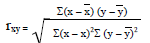
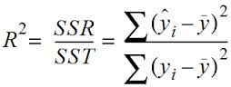
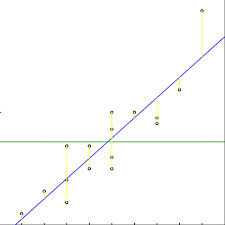

##回归中的相关度和决定系数

####皮尔逊相关系数(Pearson Correlation Coefficient)

衡量两个值线性相关强度的量。取值范围为[-1, 1]; 正向相关为**大于**0, 负向相关为**小于**0, 无相关性**等于**0。

[Correlation and Dependence](https://en.wikipedia.org/wiki/Correlation_and_dependence)

####R 平方值

定义: 决定系数, 反映因变量的全部变异能通过回归关系被自变量解释的比例。

描述: 如 R 平方为 0.8, 则表示**回归关系可以解释因变量 80% 的变异**。换句话说, 如果我们能控制自变量不变, 则因变量的变异程度会减少 80%。

[R^2 in wikipedia](https://en.wikipedia.org/wiki/Coefficient_of_determination)

> In statistics, the coefficient of determination, denoted R^2 or r^2 and pronounced "R squared", is a number that indicates the proportion of the variance in the dependent variable that is predictable from the independent variable.

简单线性回归: R^2 = r * r

多元线性回归:

> SST = SSR + SSE
> //SS  --> sum of square
> //SST --> total
> //SSR --> residuals
> //SSE --> error

R 平方也有其局限性: R 平方随着自变量的增加会变大, R平方和样本量是有关系的。因此, 我们要对 R^2 进行修正, 

