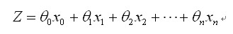
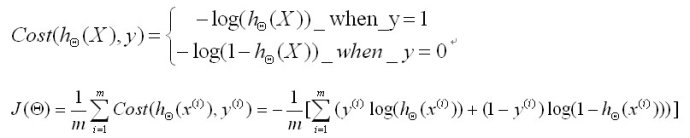

##非线性回归: logistic regression

> 概率(probability): 对每一件事发生的可能性的衡量。
> 范围 0 <= P <= 1
> 计算方法: 根据个人置信; 根据历史数据; 根据模拟数据。
> 条件概率: 
> 

###逻辑回归(logisitc regression)

例子:

Function(x) > 0.5 --> 就认为是 1。但是缺陷很大。看下图。

在用之前的 model 进行拟合, 那么就不能很好的分类。

Function(x) > 0.2 --> 就认为是 1。但是我们不能根据新的数据进来, 就调整阈值。这就意味着用线性回归是不太合理的, 这也导致了非线性回归的出现。我们并不保证数据的趋势是一条直线。

####基本模型

测试数据为$X(x_0, x_1, x_2, ... , x_n)$
要学习的参数为: $\theta (\theta_0, \theta_1, \theta_2, \theta_3, ...,\theta_n,)$

向量表示:

处理二值数据, 引入 sigmod 函数时曲线平滑化

**预测函数**:

用概率表示:

**正例(y = 1)**:

**反例(y = 0)**:

> 注意上面的 y = 1 或者 y = 0 是在给定 X 和 theta 的条件下表示我们的标签是 1 或者 0 的概率是多少。

###Cost 函数

线性回归

找到合适的$\theta_0, \theta_1$使得上式最小化。

Logistic regression:

cost函数:

要使得 cost 函数最小化, 解法有梯度下降(gradient decent):

更新法则:

> $\alpha$ 是学习率, 同时对所有$\theta$进行更新, 重复更新值到收敛。

