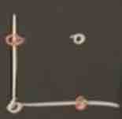
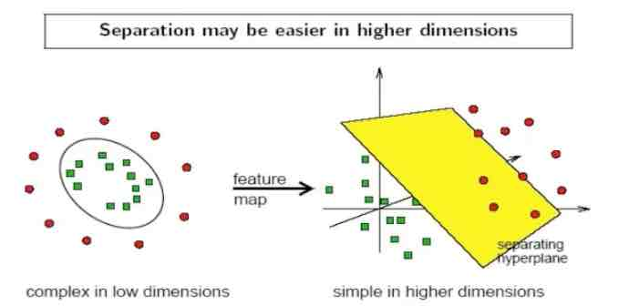
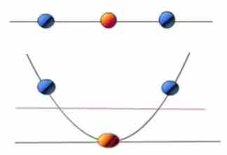

##Support Vector Machine

In machine learning, support vector machines (SVMs, also support vector networks) are supervised learning models with associated learning algorithms that analyze data used for classification and regression analysis. Given a set of training examples, each marked as belonging to one or the other of two categories, an SVM training algorithm builds a model that assigns new examples to one category or the other, making it a non-probabilistic binary linear classifier. An SVM model is a representation of the examples as points in space, mapped so that the examples of the separate categories are divided by a clear gap that is as wide as possible. New examples are then mapped into that same space and predicted to belong to a category based on which side of the gap they fall.

> 最早是在1963年提出。目前的版本(soft margin)是1993年提出, 并在1995发表
> 在深度学习之前(2012), SVM 被认为机器学习中近十几年中最成功, 表现最好的算法

###机器学习的一般框架

训练集 -> 提取特征向量 -> 结合一定算法(分类器: 比如决策树,  KNN) -> 得到结果

假如需要用一条线来区分这两个点, 那么我们如何在空间中划分这两类点呢?
假如是一个超平面(hyperplane), 如何找到很好的划分这两类的分界?

**SVM寻找区分两类的超平面(hyper plane), 使边际(margin)最大。**
 

这样的平面有无数条。如何选取使边际(margin)最大的超平面(Max Margin Hyperplane)?

> 超平面到一侧最近点的距离等于到另一侧最近点的距离, 两侧的两个超平面平行。

###基本概念

- 线性可区分(linear separable)和线性不可区分(linear inseparale)

####定义和公式

超平面可以定义为:
$$WX + b = 0$$
W: weight vector($W = {w_1, w_2, w_3, ..., w_n}$)

> 比如 2 维的时候: $X = (X_1, X_2)$
> 把 $b$ 想象为额外的 weight
> 超平面方程变为: $w_0 + w_1x_1 + w_2x_2 = 0$
> 所有超平面右上方的点满足: $w_0 + w_1x_1 + w_2x_2 > 0$
> 所有超平面左上方的点满足: $w_0 + w_1x_1 + w_2x_2 < 0$
> 调整 weight, 使超平面定义边际的两边(边界):
> $H_1: w_0 + w_1x_1 + w_2x_2 >= 1 for y_i = +1 $
> $H_2: w_0 + w_1x_1 + w_2x_2 <= -1 for y_i = -1 $

综合上面的两个公式, 得到:
$y_i(w_0 + w_1x_1 + w_2x_2) >= 1, for any i$

所有坐落在边际的两边的超平面上的被称为**"支持向量(support vector)"**。
分界的超平面和$H_1$或$H_2$上任意一点的距离为$\frac { 1 }{ \left\| w \right\|  }$
(其中||w||是向量的范数)

所以最大边际距离为: $\frac { 2 }{ \left\| w \right\|  }$

####如何找出最大边际的超平面(MMH)?

利用数学推导, 以上公式可以变为有限制的凸优化问题(convex quadratic optimization), 利用 KKT 条件和拉格朗日公式, 可以推导出 MMH 可以被表示为以下"决定边界(decision boundary)":

$X_i$表示的是支持向量点, 其中$y_i$是$X_i$(support vector)的类别标记(class label)。
$X^T$是要测试的实例, $\alpha_i$是拉格朗日的乘数, 它和$b_0$都是单一数值型参数, 由以上提到的最优化算法得出。

对于任何测试(要归类的)实例, 带入公式后得到值根据是正还是负值来归类。

例子:

[How SVM (Support Vector Machine) algorithm works]<https://www.youtube.com/watch?v=1NxnPkZM9bc>

注意在图中的绿线之上到样本之间g(x)是大于0的, 在样本的平行直线之上是大于1的。

[MIT opencourses]<https://www.youtube.com/watch?v=_PwhiWxHK8o>
**Very important**, 很有启发性。

###SVM 处理线性不可分(linearly inseparable case)的情况

回顾:
1. 训练好的模型的算法复杂度是由支持向量的个数决定的, 而不是由数据的维度决定的, 所以**SVM不太容易产生overfitting**。
2. SVM 训练出来的模型完全依赖于support vectors,  即使训练集里面所有非支持向量的点都被去除, 重复训练过程, 结果仍然会得到完全一样的模型
3. 一个 SVM 如果训练得出的支持向量个数比较小, SVM 训练出的模型比较容易被泛化(可以适应更多的例子)

可以看到, 上图中的数据集在空间中对应的向量不可被一个超平面分开。

两个步骤解决:
1. 利用一个非线性的映射把原数据集中的向量点转化到一个更高维度的空间中
2. 在这个高纬度的空间中找一个线性的超平面来根据线性可分的情况处理
 

<https://www.youtube.com/watch?v=3liCbRZPrZA>

####如何利用非线性映射把原始数据转化到高维?

例子: 3维输入向量: $X = (x_1, x_2, x_3)$

转化到 6 维空间 Z 中去:
$\phi_1(X) = x_1, \phi_2(X) = x_2, \phi_3(X) = x_3, \phi_4(X) = (x_1)^2, \phi_5(X) = x_1x_2, \phi_6(X) = x_1x_3$
新的决策超平面: $d(Z) = WZ + b$
其中 W 和 Z 是向量, 这个超平面是线性的, 解出 W 和 b 之后, 并且带入回原方程, 得到:
$d(Z) = w_1x_1 + w_2x_2 + w_3x_3 + w_4(x_1)^2 + w_5x_1x_2 + w_6x_1x_3 + b = w_1z_1 + w_2z_2 + w_3z_3 + w_4z_4 + w_5z_5 + w_6z_6 + b$

如何选择合理的非线性转化把数据转到高纬度中?
如何解决计算内积时算法复杂度非常高的问题?

====> 使用核方法(kernel trick)

动机: 在线性 SVM 中转化为最优化问题时求解的公式计算都是以内积(dot product)的形式出现的
$$\phi(X_i)\phi(X_j)$$

其中$\phi(X)$是把训练集中的向量点转化到高维的非线性映射函数, 因为内积的算法复杂度非常大, 所以利用核函数来取代计算非线性映射函数的内积

以下核函数和非线性映射函数的内积等同:
$$K(X_i, X_j) = \phi(X_i)\phi(X_j)$$

####常用的核函数(kernel function)

h 度多项式核函数(polynomial kernel of degree h):
$$K(X_i, X_j) = (X_iX_j + 1)^h$$

高斯径向基核函数(Gaussian radial basis function kernel):
$$K(X_i, X_j) = e^{(X_i - X_j)^2/2\sigma^2}$$

S 型核函数(Sigmoid function kernel)(k和$\delta$都是参数):
$$K(X_i, X_j) = tanh(kX_iX_j - \delta)$$

Q: 如何选择使用哪个kernel?
A: 根据先验知识, 比如图像处理, 通常使用 RBF, 文字不使用 RBF, 尝试使用不同的 kernel, 根据结果准确度而定。

核函数举例:
假设定义两个向量: $x = (x_1, x_2, x_3)$, $y = (y_1, y_2, y_3)$
定义方程: $f(x) = (x_1x_1, x_2x_2, x_1x_3, x_2x_1, x_2x_2, x_2x_3, x_3x_1, x_3x_2, x_3x_3)$
$$K(x, y) = (<x, y>)^2$$
假设 $x = (1, 2, 3); y = (4, 5, 6)$
$f(x) = (1, 2, 3, 2, 4, 6, 3, 6, 9)$
$f(y) = (16, 20, 24, 20, 25, 36, 24, 30, 36)$
$<f(x), f(y)> = 16 + 20 + 72 + 40 + 100 + 180 + 72 + 180 + 324 = 1024$
$K(x, y) = (4 + 10 + 18)^2 = 32^2 = 1024$
同样的结果, 使用kernel方法计算简单很多。

####SVM 拓展可解决多个类别分类问题

<http://blog.csdn.net/puqutogether/article/details/41679605>

1. one vs. other
这种改进SVM的方法简单粗暴, 也易于理解。详细来说, 比如我们的数据有5个类别。
Step 1: 把类别1的样本定为正样本, 其余2, 3, 4, 5类的样本定为负样本。使用SVM分类器, 得到一个二类分类器
Step 2: 把类别2的样本定为正样本, 其余1, 3, 4, 5类的样本定为负样本。使用SVM分类器, 得到一个二类分类器
Step 3: 把类别3的样本定为正样本, ...
Step 4: 把类别4的样本定为正样本, ...
Step 5: 把类别5的样本定为正样本, ...
Step 6: 对测试样本, 依次使用上面训练学习得到的5个分类器, 每个分类器都可以得出结论, 要么是第i类, 要么就是其他(the other), 直到我们发现有一个分类器说这样测试样本是我的, 即可。这样改进方法比较简单, 时间复杂度也不是很高。但是, 仔细想一下问题来了: 有时候会出现5个分类器都说这样测试样本是自己的, 或者都是不是自己的……这个时候怎么办？
- 如果说都是自己的, 这叫**分类重叠现象**。这个可以选择SVM的间隔最大的那个分类器确定最终结果, 或者使用投票的原则;
- 如果说都不是自己的, 这叫**不可分类现象**。这个时候就不好解决了, 得不到正确的结果。
此外, 这种方法还有一个缺点: 认为造成了**类不平衡**问题。而且, 当数据类别很多的时候, other那一类的数据量会是one这一类的好多倍, SVM分类器会严重错误的把结果偏向于other的大类, 这个时候就不是不可分类现象了, 而是你SVM分类器就给直接分错了。

2. one vs. one
这种方法还是把多类问题转化为多个二类问题, 只不过每个二类问题中都是“one vs. one”的方式。这个时候就没有类不平衡问题了。
Step 1: 把类别1的样本定为正样本, 类别2定为负样本。使用SVM分类器, 得到一个二类分类器；
Step 2: 把类别1的样本定为正样本, 类别3定为负样本。使用SVM分类器, 得到一个二类分类器；
......(一共有C(5, 2)=10个分类器)
Step 11: 让测试样本依次通过后面的分类器做判断, 每次都会得到是否为第1类还是第2类, 然后给5个类别投票, 选择最高的作为最后的结果(一个类得票最高为4票)。
这种方法也有分类重叠的现象。而且, 当数据集类别增多的时候, 我们需要学习的二类分类器就会很多, 比刚才的那种one vs. other的方法多很多, 时间复杂度很大。

