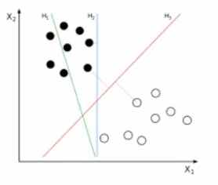
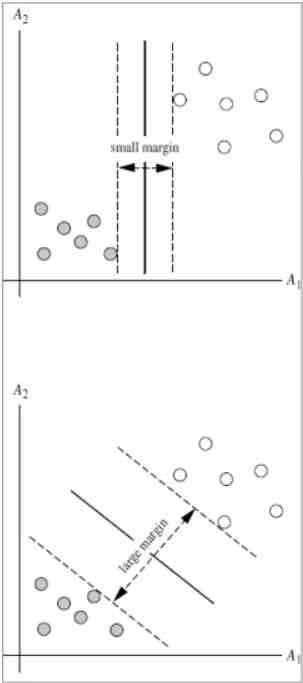
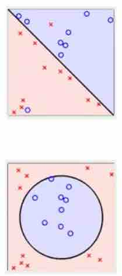
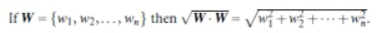
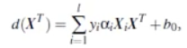
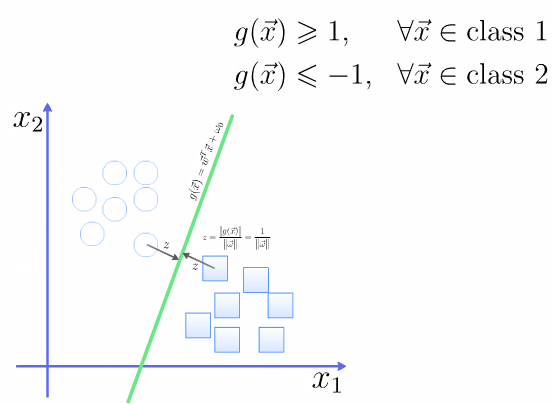
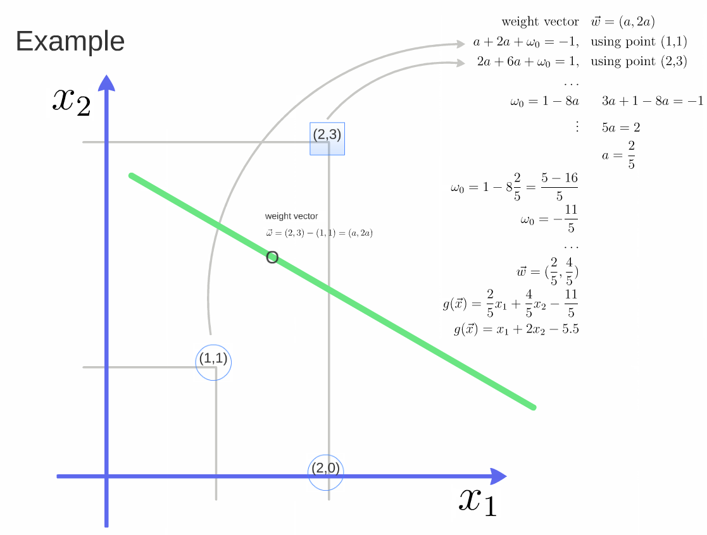

##Support Vector Machine

In machine learning, support vector machines (SVMs, also support vector networks) are supervised learning models with associated learning algorithms that analyze data used for classification and regression analysis. Given a set of training examples, each marked as belonging to one or the other of two categories, an SVM training algorithm builds a model that assigns new examples to one category or the other, making it a non-probabilistic binary linear classifier. An SVM model is a representation of the examples as points in space, mapped so that the examples of the separate categories are divided by a clear gap that is as wide as possible. New examples are then mapped into that same space and predicted to belong to a category based on which side of the gap they fall.

> 最早是在1963年提出。目前的版本(soft margin)是1993年提出, 并在1995发表
> 在深度学习之前(2012), SVM 被认为机器学习中近十几年中最成功, 表现最好的算法

###机器学习的一般框架

训练集 -> 提取特征向量 -> 结合一定算法(分类器: 比如决策树,  KNN) -> 得到结果

假如需要用一条线来区分这两个点, 那么我们如何在空间中划分这两类点呢?
假如是一个超平面(hyperplane), 如何找到很好的划分这两类的分界?

**SVM寻找区分两类的超平面(hyper plane), 使边际(margin)最大。**
 

这样的平面有无数条。如何选取使边际(margin)最大的超平面(Max Margin Hyperplane)?

> 超平面到一侧最近点的距离等于到另一侧最近点的距离, 两侧的两个超平面平行。

###基本概念

- 线性可区分(linear separable)和线性不可区分(linear inseparale)

####定义和公式

超平面可以定义为:
$$WX + b = 0$$
W: weight vector($W = {w_1, w_2, w_3, ..., w_n}$)

> 比如 2 维的时候: $X = (X_1, X_2)$
> 把 $b$ 想象为额外的 weight
> 超平面方程变为: $w_0 + w_1x_1 + w_2x_2 = 0$
> 所有超平面右上方的点满足: $w_0 + w_1x_1 + w_2x_2 > 0$
> 所有超平面左上方的点满足: $w_0 + w_1x_1 + w_2x_2 < 0$
> 调整 weight, 使超平面定义边际的两边(边界):
> $H_1: w_0 + w_1x_1 + w_2x_2 >= 1 for y_i = +1 $
> $H_2: w_0 + w_1x_1 + w_2x_2 <= -1 for y_i = -1 $

综合上面的两个公式, 得到:
$y_i(w_0 + w_1x_1 + w_2x_2) >= 1, for any i$

所有坐落在边际的两边的超平面上的被称为**"支持向量(support vector)"**。
分界的超平面和$H_1$或$H_2$上任意一点的距离为$\frac { 1 }{ \left\| w \right\|  }$
(其中||w||是向量的范数)

所以最大边际距离为: $\frac { 2 }{ \left\| w \right\|  }$

####如何找出最大边际的超平面(MMH)?

利用数学推导, 以上公式可以变为有限制的凸优化问题(convex quadratic optimization), 利用 KKT 条件和拉格朗日公式, 可以推导出 MMH 可以被表示为以下"决定边界(decision boundary)":

$X_i$表示的是支持向量点, 其中$y_i$是$X_i$(support vector)的类别标记(class label)。
$X^T$是要测试的实例, $\alpha_i$是拉格朗日的乘数, 它和$b_0$都是单一数值型参数, 由以上提到的最优化算法得出。

对于任何测试(要归类的)实例, 带入公式后得到值根据是正还是负值来归类。

例子:

[How SVM (Support Vector Machine) algorithm works]<https://www.youtube.com/watch?v=1NxnPkZM9bc>

注意在图中的绿线之上到样本之间g(x)是大于0的, 在样本的平行直线之上是大于1的。

[MIT opencourses]<https://www.youtube.com/watch?v=_PwhiWxHK8o>
**Very important**, 很有启发性。

