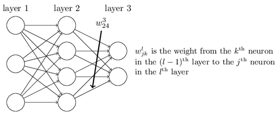
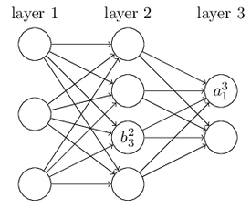
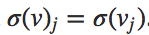
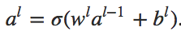
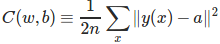
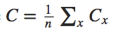
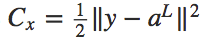
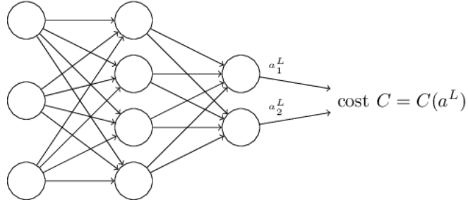
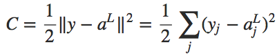
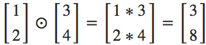

###Backpropagation Algorithm

<http://neuralnetworksanddeeplearning.com/chap2.html>

思考假如我们使用每张图片的平均灰度来衡量是什么数字，那么和用神经网络得到的准确率差多少？

[Average Darkness](./lab/mnist_average_greyscale.py)

结果是很差，结果如下：

```
Baseline classifier using average darkness of image.
2225 of 10000 values correct.
```

SVM 效果不错但是仅仅能达到神经网络的基本水平。

[SVM Trying](./lab/mnist_svm.py)

```
Baseline classifier using a SVM.
9435 of 10000 values correct!
```

<hr>


Backpropagation 在 1970 年被提出，在 1986 年才得到重视。

它解决的核心问题：COST 函数对于权重的偏导，COST 函数对于 bias 的偏导。针对 COST 函数 C。





（每一个神经元对应一个偏向 b, 但是注意每个神经元也有一个激活值 a)


Vectorzing a function:




其中 l 表示第 l 层。用矩阵和向量表示简单很多，对于每一层，只需要乘以权重的矩阵，加上偏向的向量。


关于 cost 函数的两个假设：



L: 神经网络的层数。求和是对于所有单个的训练实例 x 加起来，然后求平均 cost。


假定 1: cost 函数可以写成如下


这是在求平均的 cost。


对于单个 x 的 cost。


因为对于 Backpropagation, 对于权重和偏向的偏导是通过单个实例 x 完成的。



cost可以被写成神经网络输出的一个函数, 即我们定义的这个二次cost方程满足这点:




> Hadamard product:
> 元素对应相乘
> 


Backpropagation 的四个关键公式: 见pdf


