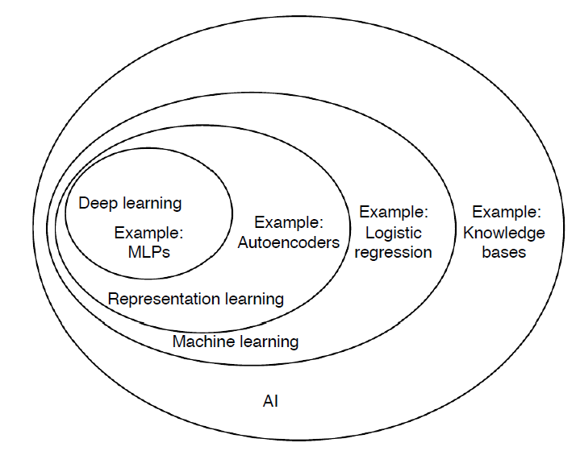
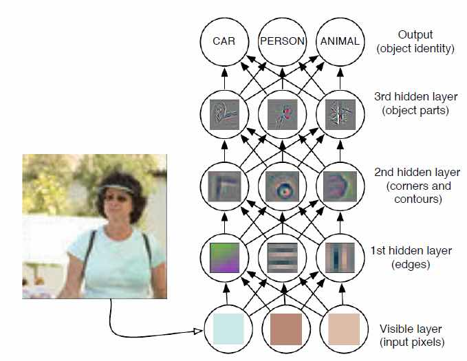
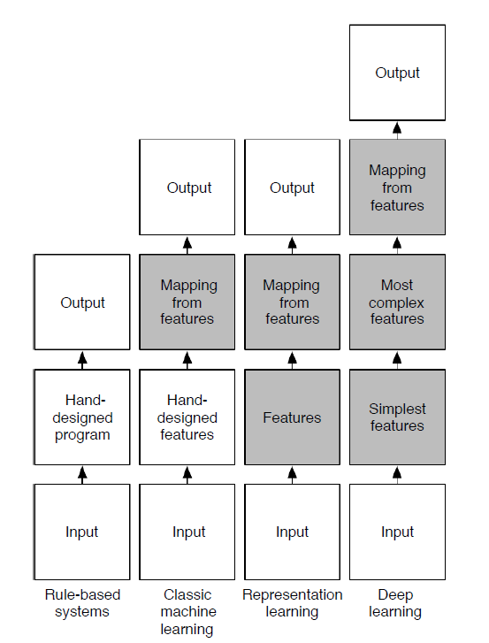

##Deep Learning

Framework and reference

###监督学习

- 神经网络算法(Neural Network): 手写数字识别
- 梯度下降(Gradient Descent): 图像中的物体识别
- 卷积神经网络(Convolutional Neural Network): 人脸识别
- 深度卷积网络(Convolutional Neural Network): 视频分类

###非监督学习

- 限制玻尔兹曼机(Restricted Boltzmann Machine): 图像与文字特征合并应用对图像分类
- 自动编码(Autoencoder): 图像中的物体识别
- 深度信念网络(Deep Belief Network): 猫狗分类

Neural networks and deep learning currently provide the best solutions to many problems in image recognition, speech recognition, and natural language processing. This book will teach you many of the core concepts behind neural networks and deep learning.

图中有一个`Representation Learning`, 在ML的基础上, 对每一个物体我们要学习出来一个代表, **机器学习很大程度都在于我们如何设计出比较好的特征向量来代表我们的实例**。

###深度学习基本模型

###机器学习与深度学习

上图中, `Rule-based systems`是传统的机器学习, 即以规则来学习。
`Classic machine learning`重点就是feature, 用这种特征向量可以很好的分类, 再根据分类器进行输出。
`Representation learning`重点是通过一些学习的方法得到特征向量。
`Deep learning`重点的最小的特征, 通过学习把其中的关系找到, 自动学习那些最有特征的特征点学到最有效区分的效果。

REF: Michael A.Nielsen, "Neural Networks and Deep Learning", Detemination Press, 2015

